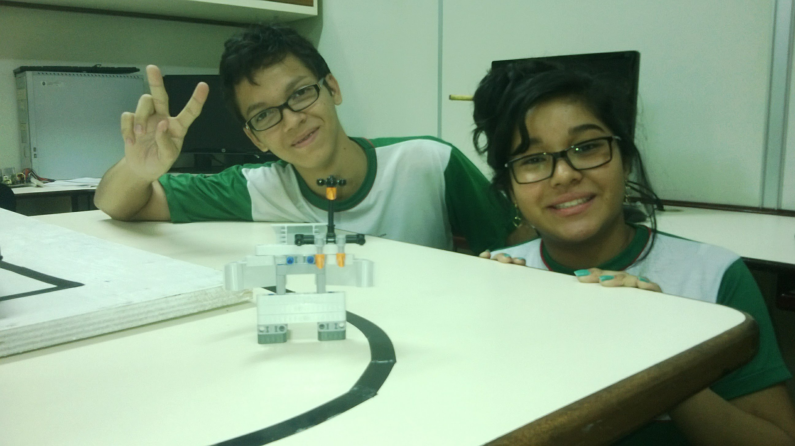
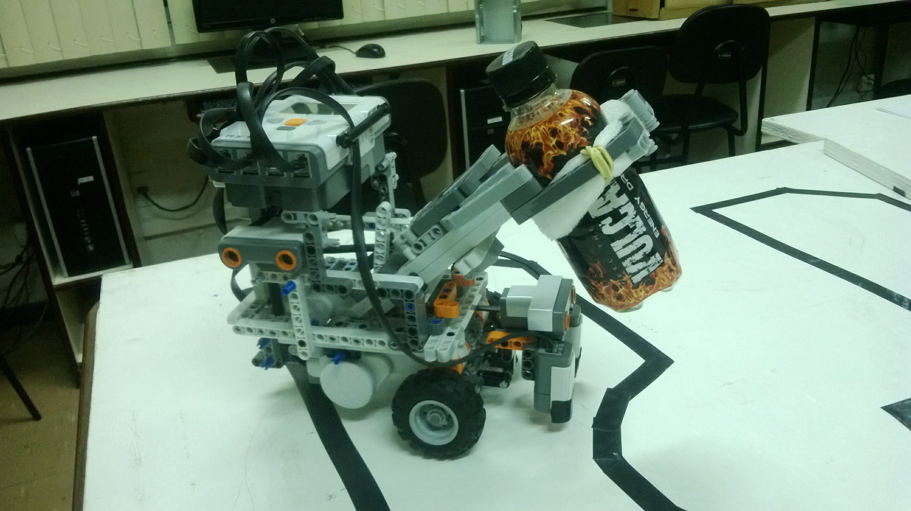
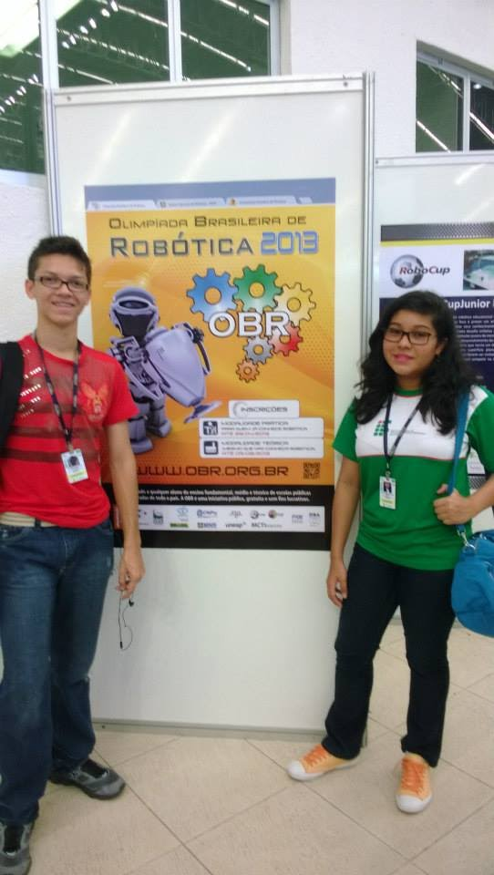
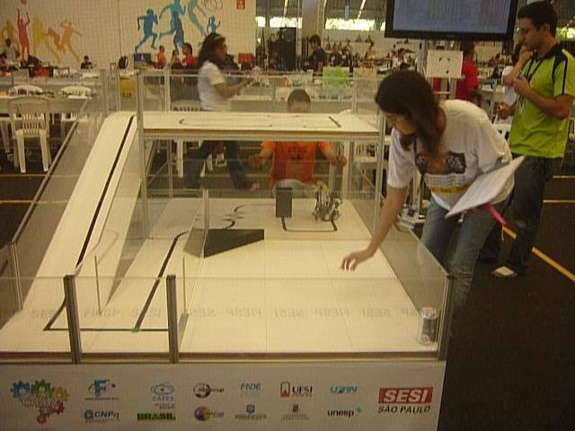
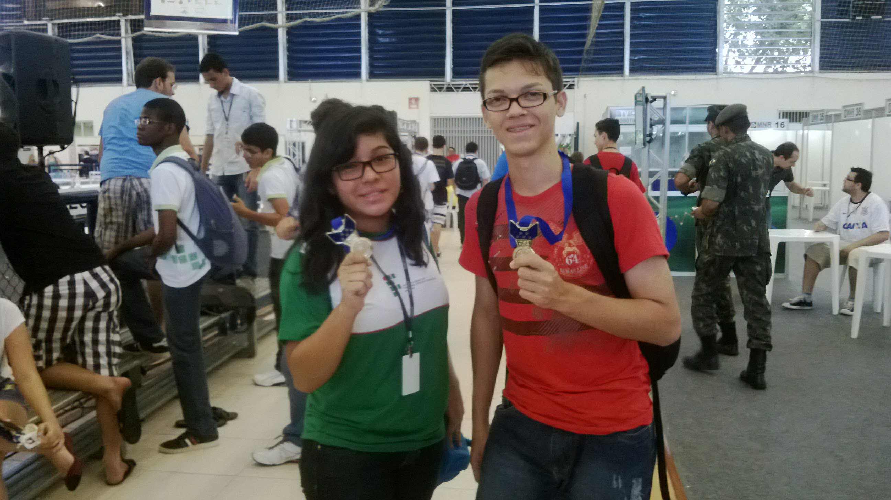
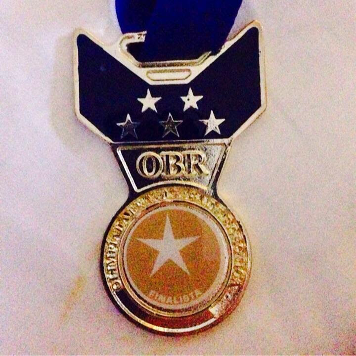

# Brazilian Robotics Olympiad (OBR) - 2013

#### Description:

> The Brazilian Robotics Olympiad, or OBR, is a knowledge Olympiad for primary and secondary school students. It was founded as part of an initiative by robotics researchers to spread robotics in Brazilian society. [Wikipédia](https://pt.wikipedia.org/wiki/Olimp%C3%ADada_Brasileira_de_Rob%C3%B3tica)

## OBR 2013

As a high school student I participated in the Brazilian Robotics Olympics as a representative of the Amazonas State and member of the IFAMTICS team. The competition took place in Fortaleza-CE in the year 2013.

## Memories

|     |       |
| -------------------------------- | ---------------------------- |
|  |  |
|        |     |

## Certificate

